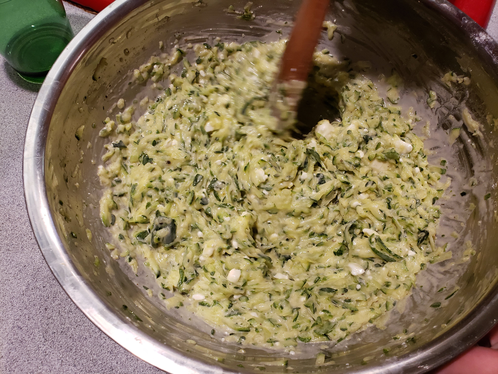

# Courtesy of The Light-Bringer

8 medium zucchini. Preferably Gray squash. Grated on large holes of box grater.

3 Eggs

8 oz Feta Cheese. Clarify with L.B. whether he means Goat cheese or Feta cheese, which is technically from a sheep

1/4 cup Extra virgin olive oil

1-2 tsp fresh thyme

Not alot of oregano

1/2 cup + a pinch of flour

black pepper

1. Place zucchini in a colander and add ~1 tbsp of salt. Mix and let sit/drain for 20 minutes
2. Squeeze the remaining water out of the zucchini
3. Add eggs, ~6 oz of feta, olive oil, oregano, thyme, 1 tsp salt, and black pepper to shredded zucchini and mix. 
4. Mix in flour bit by bit until it desired consistency is reached. See picture
5. Add mixture to greased 9x13 pan, crumble remaining feta over top with a drizzle of olive oil, and bake at 40 minutes at 370 F
## 11/28/2019 THANKSGIVING
### Adjustments

Everthing not reflected in the above recipe 
### Notes

LB assures us that foaming in the zucchini when mixing in the salt is normal. We trust him.
LB said the mixture was on the wetter side this time around
### Images

